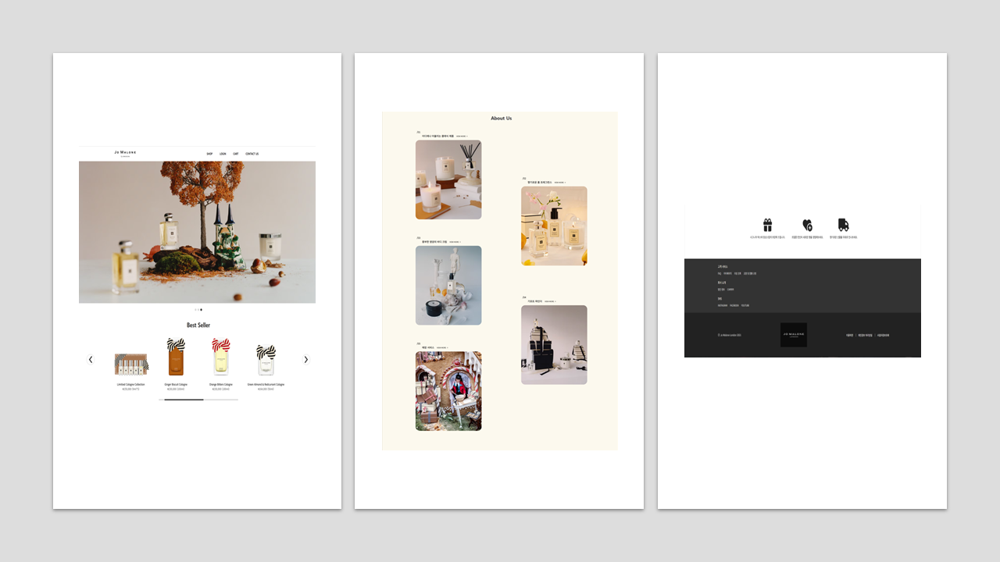
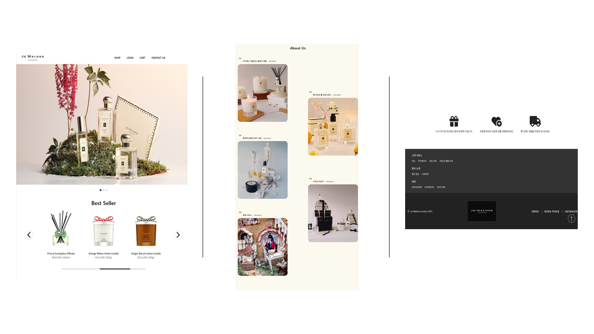
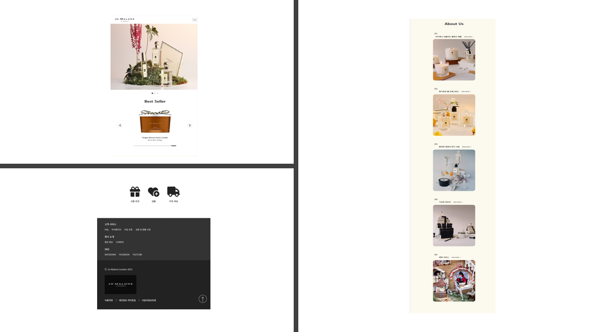
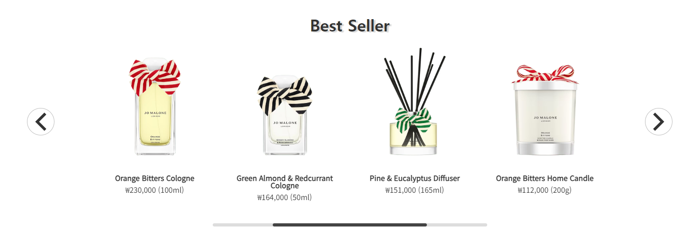
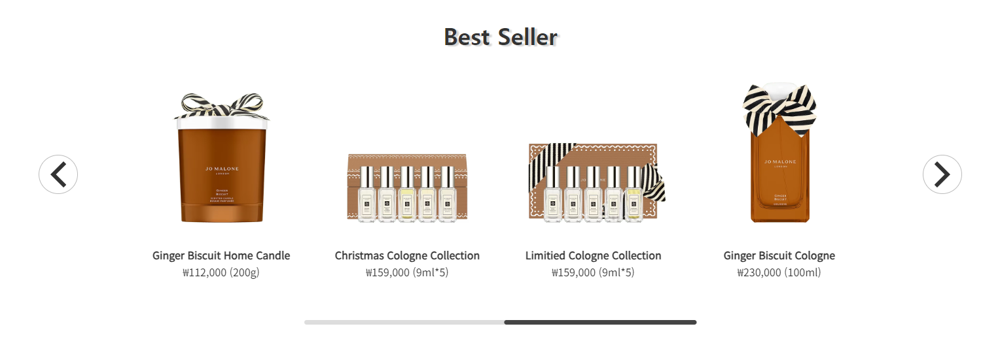
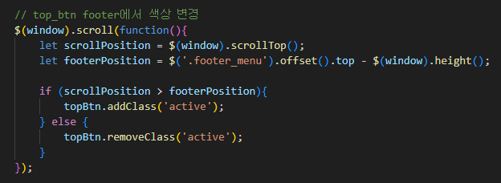
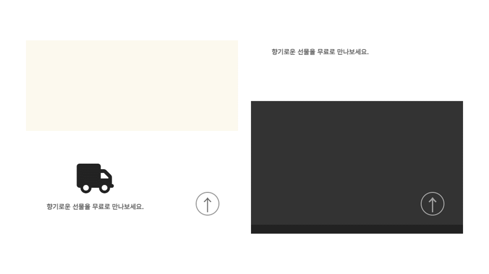

# PORTFOLIO_JO-MALONE 🧴
 

# 📖 Description
[조말론] 사이트를  리디자인한 프로젝트입니다.
#### 리디자인한 이유 ?
1) 기존 사이트의 얇은 폰트
2) 정돈되어 있지 않은 footer 디자인과 전체 디자인으로 인해 집중이 되지 않음
 

### 📌 개발 기간
2023.10.20 ~ 2023.11.10

### 📌 Stacks
#### [Environment]
VISUAL STUDIO CODE, GIT, GITHUB

#### [Development]
JavaScript, jQuery, Swiper
 
 
# 🖥 화면 구성
#### [PC]

#### [Tablet]

#### [Mobile]

 

# 💥 오류 수정
## 1️⃣ slidesPerView: 4일 경우, 마지막 item에서 처음 item으로 넘어가지지 않음

#### ✔ WHY ?
전체 슬라이드 개수가 7개였음  
한번에 보이는 개수가 절반보다 많은 4로 설정되어 있기 때문에 슬라이드 error 발생

#### ✔ HOW ?
전체 슬라이드를 하나 더 추가하여 8개로 만들면? -> 처음 item으로 넘어가짐

 

# ⭐ 기능 구현
## 1️⃣ top_btn을 footer에서만 색상 변경

##### $(window).scrollTop();
: 현재 스크롤바의 위치값

##### $('.footer_menu').offset().top
: '.footer_menu' 요소의 오프셋 상단 위치를 제공

##### $(window).height();
: 브라우저 창의 높이 (실제 화면에 나타나는 영역의 폭과 너비)

 

#### [ $(window).height()를 빼는 이유 ? ]
: footer_menu 바로 위의 높이를 알기 위해 빼야 함

 

#### ✔ footer 부분(검은 바탕)에서만 하얀색으로 변경

